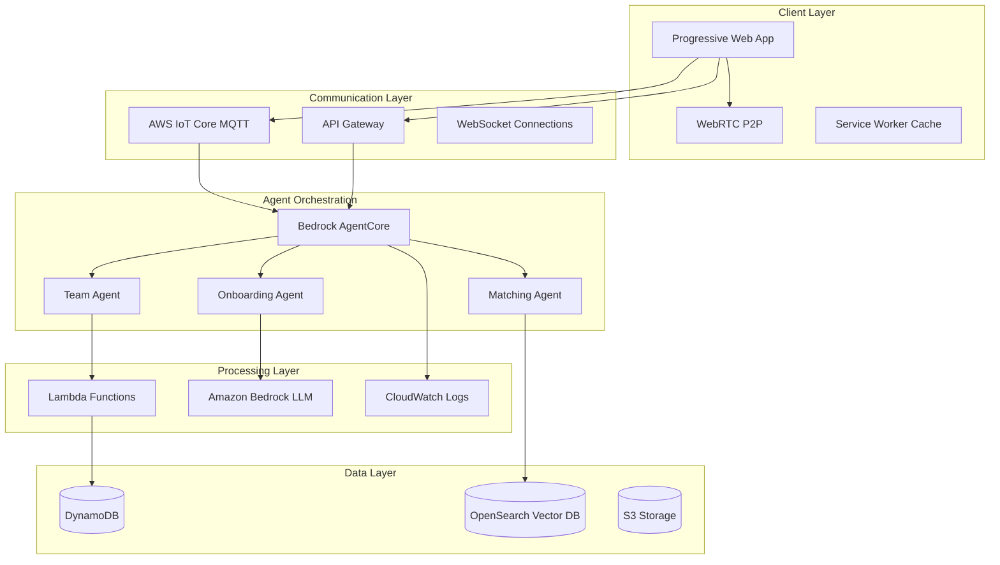

# Design Document

## Overview

Find Your Team (FYT) is architected as a free, open-source, resilient multi-agent platform that leverages Amazon Bedrock AgentCore for orchestrating three specialized AI agents. The system is designed to maximize human potential utilization by making it irresistibly valuable for individuals and teams to connect, collaborate, and contribute their best work to the people they love.

The architecture follows a microservices pattern with event-driven communication, ensuring each component can scale independently while maintaining system coherence through the central Insight Database and agent orchestration layer. The platform is designed to be self-sustaining through community contributions and optional enterprise services while remaining completely free for individual users.

**Core Design Principles:**
- **Universal Access**: Works offline, online, and in low-bandwidth conditions
- **Irresistible Value**: Provides such compelling benefits that non-adoption becomes irrational  
- **Community-Driven**: Open-source with transparent development and governance
- **Human-Centric**: Optimizes for human fulfillment and potential maximization
- **Local Impact**: Enables communities to become more effective and self-sufficient

## Architecture

### High-Level System Architecture



### Multi-Agent System Design

The three-agent architecture is orchestrated through Amazon Bedrock AgentCore, with each agent having specialized responsibilities and data access patterns:

1. **Onboarding Agent**: Conversational AI focused on empathetic profile building
2. **Matching Agent**: RAG-powered system for contextual team matching
3. **Team Agent**: Performance monitoring and coaching system with tool execution capabilities

## Components and Interfaces

### 1. Progressive Web App (PWA) Frontend

**Technology Stack:**
- React 18 with TypeScript
- Vite for build optimization
- Workbox for service worker management
- IndexedDB for local storage
- PeerJS for WebRTC implementation

**Key Features:**
- Offline-first architecture with full UI caching
- Real-time chat interface with multiple protocol support
- Responsive design optimized for mobile and desktop
- Client-side privacy controls with local profile storage

**Interface Specifications:**
```typescript
interface UserProfile {
  id: string;
  realProfile: PersonalProfile;
  publicProfile: PublicProfile;
  privacySettings: PrivacyConfig;
  confidenceScore: number;
}

interface ChatMessage {
  id: string;
  userId: string;
  content: string;
  timestamp: number;
  protocol: 'mqtt' | 'webrtc' | 'queued';
  encrypted: boolean;
}
```

### 2. Communication Infrastructure

**AWS IoT Core MQTT Broker:**
- Handles millions of concurrent WebSocket connections
- Message routing with topic-based subscriptions
- Built-in device authentication and authorization
- Store-and-forward capability for intermittent connectivity

**WebRTC Peer-to-Peer:**
- Direct browser-to-browser communication for local networks
- Automatic subnet detection and peer discovery
- Fallback to MQTT when P2P connection fails
- Zero-server dependency for local team collaboration

**Message Queue Architecture:**
```typescript
interface MessageQueue {
  queuedMessages: ChatMessage[];
  syncStatus: 'online' | 'offline' | 'syncing';
  lastSync: timestamp;
  compressionEnabled: boolean;
}
```

### 3. Agent System Architecture

**Onboarding Agent (The Guide):**
- **LLM**: Claude 3.5 Sonnet via Amazon Bedrock
- **Memory**: Bedrock Memory for conversation context
- **Objective**: Build comprehensive Purpose Profile with ≥90% confidence
- **Tools**: Personality assessment, values alignment, skill evaluation

**Matching Agent (The Orchestrator):**
- **RAG System**: Amazon OpenSearch with vector embeddings
- **Knowledge Base**: Semantic search across team needs and user profiles
- **Objective**: Deliver explainable matches with XAI summaries
- **Tools**: Similarity search, compatibility scoring, opportunity ranking

**Team Agent (The Coach):**
- **Runtime**: AgentCore with AWS Lambda action groups
- **Objective**: Continuous performance monitoring and improvement
- **Tools**: Project status checking, retrospective generation, performance analytics
- **Actions**: Database updates, coaching recommendations, conflict resolution

### 4. Data Architecture

**Amazon DynamoDB (Primary Database):**
```json
{
  "UserProfiles": {
    "PartitionKey": "userId",
    "Attributes": {
      "purposeProfile": "Object",
      "skillsMatrix": "Object",
      "performanceMetrics": "Object",
      "teamHistory": "List"
    }
  },
  "TeamPerformance": {
    "PartitionKey": "teamId",
    "SortKey": "timestamp",
    "Attributes": {
      "metrics": "Object",
      "agentInsights": "Object",
      "improvementSuggestions": "List"
    }
  }
}
```

**Amazon OpenSearch (Vector Database):**
- Stores semantic embeddings of successful team patterns
- Indexes project descriptions, skill requirements, and cultural fit data
- Enables contextual matching based on unstructured data
- Supports real-time similarity search with sub-second response times

### 5. Agent Tool Integration

**Lambda Action Groups:**
```python
# Team Agent Tools
def check_project_status(team_id: str) -> dict:
    """Retrieve current project metrics and status"""
    
def generate_retrospective(team_id: str, period: str) -> dict:
    """Create customized team retrospective report"""
    
def update_performance_metrics(team_id: str, metrics: dict) -> bool:
    """Update team performance data in Insight Database"""
    
def provide_coaching_insight(user_id: str, context: dict) -> str:
    """Generate personalized coaching recommendation"""
```

## Data Models

### Core Data Structures

**Purpose Profile Model:**
```typescript
interface PurposeProfile {
  userId: string;
  values: {
    core: string[];
    secondary: string[];
    weights: Record<string, number>;
  };
  workStyle: {
    collaboration: 'high' | 'medium' | 'low';
    autonomy: 'high' | 'medium' | 'low';
    structure: 'flexible' | 'moderate' | 'structured';
    communication: 'direct' | 'diplomatic' | 'supportive';
  };
  skills: {
    technical: SkillLevel[];
    soft: SkillLevel[];
    leadership: SkillLevel[];
  };
  passions: string[];
  confidenceScore: number;
  lastUpdated: timestamp;
}
```

**Team Performance Model:**
```typescript
interface TeamPerformance {
  teamId: string;
  members: string[];
  metrics: {
    productivity: number;
    collaboration: number;
    satisfaction: number;
    goalAchievement: number;
  };
  trends: {
    period: string;
    improvement: number;
    challenges: string[];
    successes: string[];
  };
  agentRecommendations: CoachingInsight[];
  lastAssessment: timestamp;
}
```

**Match Result Model:**
```typescript
interface MatchResult {
  userId: string;
  opportunities: {
    teamId: string;
    role: string;
    alignmentScore: number;
    gapScore: number;
    explanation: XAIExplanation;
    requirements: string[];
    benefits: string[];
  }[];
  confidence: number;
  reasoning: string;
  nextSteps: string[];
}
```

## Error Handling

### Resilient Communication Strategy

**Network Failure Handling:**
1. **Connection Loss**: Automatic fallback to local storage queuing
2. **Partial Connectivity**: MQTT store-and-forward with compression
3. **Agent Unavailability**: Graceful degradation with cached responses
4. **Data Sync Conflicts**: Last-write-wins with user notification

**Agent Error Recovery:**
```typescript
interface AgentErrorHandler {
  retryPolicy: {
    maxRetries: number;
    backoffStrategy: 'exponential' | 'linear';
    timeoutMs: number;
  };
  fallbackBehavior: {
    onboardingFallback: 'cached_questions' | 'simplified_flow';
    matchingFallback: 'basic_algorithm' | 'manual_browse';
    teamFallback: 'static_tips' | 'peer_feedback';
  };
  errorReporting: {
    logLevel: 'error' | 'warn' | 'info';
    cloudWatchIntegration: boolean;
    userNotification: boolean;
  };
}
```

### Data Consistency and Validation

**Profile Validation:**
- Confidence score thresholds before agent handoffs
- Data integrity checks on profile updates
- Conflict resolution for concurrent modifications
- Backup and recovery procedures for critical data

**Performance Metric Validation:**
- Anomaly detection for unusual performance changes
- Cross-validation of team metrics across multiple sources
- Audit trails for all Team Agent database updates
- Data quality monitoring and alerting

## Testing Strategy

### Multi-Agent System Testing

**Agent Integration Testing:**
1. **Handoff Validation**: Test successful transitions between agents
2. **Memory Consistency**: Verify conversation context preservation
3. **Tool Execution**: Validate Lambda action group functionality
4. **Performance Benchmarks**: Measure response times and accuracy

**End-to-End User Journey Testing:**
```typescript
describe('Complete User Journey', () => {
  test('Onboarding to Team Assignment', async () => {
    // 1. User completes onboarding with Onboarding Agent
    // 2. Profile achieves ≥90% confidence score
    // 3. Matching Agent finds suitable opportunities
    // 4. User joins team and Team Agent activates
    // 5. Performance metrics show improvement over time
  });
});
```

### Resilience Testing

**Network Condition Simulation:**
- Offline mode functionality validation
- Intermittent connectivity handling
- Low-bandwidth performance optimization
- WebRTC peer discovery and fallback testing

**Load and Scale Testing:**
- Concurrent user simulation (target: 10,000+ simultaneous)
- Agent response time under load
- Database performance with large datasets
- MQTT broker capacity testing

### Privacy and Security Testing

**Data Protection Validation:**
- Client-side encryption verification
- Privacy setting enforcement
- Anonymous mode functionality
- Data leakage prevention testing

**Security Penetration Testing:**
- Authentication and authorization validation
- Message interception prevention
- Agent prompt injection resistance
- AWS service security configuration audit

### Performance Monitoring

**Real-time Metrics:**
- Agent response times and accuracy rates
- User engagement and retention metrics
- Team performance improvement tracking
- System availability and error rates

**Human Potential Utilization Metrics:**
- Talent discovery and activation rates
- Underutilized skills identification and development
- Community value creation and impact measurement
- Local team effectiveness and satisfaction scores

**Open Source Community Metrics:**
- Contributor engagement and code contributions
- Community-driven feature development
- Platform adoption and viral growth rates
- User-generated success stories and testimonials

**Irresistible Value Indicators:**
- Time-to-value for new users (target: <5 minutes)
- User referral rates and organic growth
- Platform abandonment rates (target: <5%)
- Community self-sufficiency and sustainability metrics