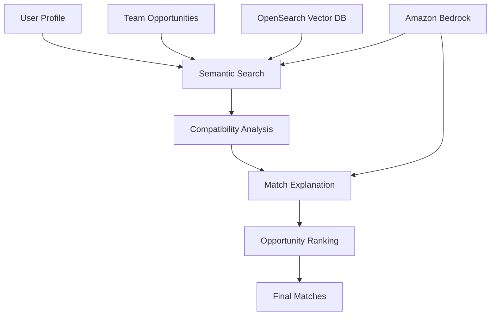

# Find Your Team - Matching Agent MCP Tools

This implementation provides a comprehensive set of MCP (Model Context Protocol) compatible tools for intelligent team matching in the Find Your Team platform.

## Overview

The Matching Agent uses advanced AI techniques including:
- **Semantic Search**: Vector embeddings with Amazon Bedrock Titan
- **Compatibility Analysis**: Multi-dimensional scoring across skills, values, work style, and purpose
- **Explainable AI**: Claude 3.5 Sonnet generates detailed match explanations
- **Skill Gap Analysis**: Identifies development opportunities
- **Team Composition Analysis**: Optimizes team formation

## Architecture

### Core Components

1. **MatchingAgentTools**: Core tool implementations
2. **MatchingAgentMCPServer**: MCP protocol wrapper
3. **ToolResult**: Standardized result format
4. **Configuration**: JSON-based tool configuration

### MCP Tools Available

#### 1. `semantic_search_teams`
Searches for teams using semantic similarity based on user profiles.

**Parameters:**
- `query_text` (string): Text representation of user profile
- `limit` (integer): Maximum results (default: 5)
- `min_score` (number): Minimum similarity threshold (default: 0.7)
- `filters` (object): Additional search filters

**Returns:**
- Search results with similarity scores
- Query metadata
- Result count and timing

#### 2. `analyze_compatibility`
Analyzes compatibility between user and team profiles.

**Parameters:**
- `user_profile` (object): Complete user profile data
- `team_profile` (object): Team profile and requirements
- `weights` (object): Compatibility factor weights

**Returns:**
- Detailed compatibility scores (skills, values, work style, purpose)
- Overall compatibility rating
- Analysis summary and recommendations

#### 3. `generate_match_explanation`
Generates detailed explanations for team matches using AI.

**Parameters:**
- `user_profile` (object): User's profile
- `team_opportunity` (object): Team opportunity details
- `compatibility_score` (number): Calculated compatibility score
- `explanation_type` (string): Type of explanation (detailed/summary/bullet_points)

**Returns:**
- AI-generated explanation
- Alignment factors
- Gap factors and growth opportunities
- Actionable recommendations

#### 4. `rank_opportunities`
Ranks and prioritizes team opportunities for users.

**Parameters:**
- `user_profile` (object): User's complete profile
- `opportunities` (array): List of team opportunities
- `ranking_criteria` (object): Ranking preferences

**Returns:**
- Ranked opportunities with scores
- Ranking factors for each opportunity
- Personalized prioritization

#### 5. `analyze_team_composition`
Analyzes current team composition and suggests improvements.

**Parameters:**
- `current_members` (array): Current team members
- `team_goals` (object): Team objectives
- `analysis_focus` (string): Focus area (skills/diversity/leadership/collaboration)

**Returns:**
- Composition analysis
- Identified gaps and strengths
- Improvement suggestions

#### 6. `identify_skill_gaps`
Identifies skill gaps in profiles and generates development plans.

**Parameters:**
- `target_profile` (object): Profile to analyze
- `required_skills` (array): Required skills list
- `gap_threshold` (number): Threshold for considering gaps

**Returns:**
- Detailed skill gap analysis
- Skill matches and levels
- Personalized development plan

## Usage Examples

### MCP Server Mode

```bash
# Run as MCP server
python agents/matching_agent_mcp_server.py

# Run with custom configuration
python agents/matching_agent_mcp_server.py --config agents/matching_agent_config.json
```

### Standalone Demo Mode

```bash
# Run standalone demo
python agents/matching_agent_mcp_server.py --demo
```

### Programmatic Usage

```python
from agents.matching_agent import MatchingAgentTools

# Initialize tools
tools = MatchingAgentTools(
    opensearch_endpoint="your-opensearch-endpoint",
    opensearch_index="team-opportunities"
)

# Use semantic search
result = await tools.semantic_search_teams(
    query_text="Python developer interested in sustainability",
    limit=5,
    min_score=0.7
)

# Analyze compatibility
compatibility = await tools.analyze_compatibility(
    user_profile=user_data,
    team_profile=team_data
)

# Generate explanation
explanation = await tools.generate_match_explanation(
    user_profile=user_data,
    team_opportunity=team_data,
    compatibility_score=0.85
)
```

## Configuration

### Environment Variables

```bash
export AWS_REGION=us-east-1
export OPENSEARCH_ENDPOINT=your-opensearch-endpoint
export BEDROCK_MODEL_ID=amazon.titan-embed-text-v1
```

### Configuration File

```json
{
  "opensearch_endpoint": "localhost:9200",
  "opensearch_index": "team-opportunities",
  "bedrock_model_id": "amazon.titan-embed-text-v1",
  "claude_model_id": "anthropic.claude-3-5-sonnet-20240620",
  "tool_settings": {
    "semantic_search": {
      "default_limit": 5,
      "min_score_threshold": 0.7
    },
    "compatibility_analysis": {
      "default_weights": {
        "skills": 0.3,
        "values": 0.3,
        "work_style": 0.2,
        "purpose": 0.2
      }
    }
  }
}
```

## Integration with Find Your Team

### Agent Workflow

1. **User Onboarding**: Onboarding Agent builds Purpose Profile
2. **Matching Request**: User requests team matches
3. **Semantic Search**: Find relevant opportunities using embeddings
4. **Compatibility Analysis**: Score each opportunity across multiple dimensions
5. **Explanation Generation**: Create detailed match explanations
6. **Ranking**: Prioritize opportunities based on user preferences
7. **Presentation**: Display ranked matches with explanations

### Data Flow



## Testing

### Unit Tests

```bash
# Run unit tests
python -m pytest tests/test_matching_agent_tools.py -v
```

### Integration Tests

```bash
# Run integration tests (requires AWS credentials)
python tests/test_matching_agent_tools.py
```

### Manual Testing

```bash
# Test individual tools
python -c "
import asyncio
from agents.matching_agent import MatchingAgentTools

async def test():
    tools = MatchingAgentTools()
    result = await tools.semantic_search_teams(
        query_text='Python developer',
        limit=3
    )
    print(result.to_dict())

asyncio.run(test())
"
```

## Performance Considerations

### Optimization Features

- **Embedding Caching**: Cache embeddings to reduce API calls
- **Batch Processing**: Process multiple requests efficiently
- **Async Operations**: Non-blocking tool execution
- **Error Handling**: Graceful degradation on failures

### Scaling

- **Concurrent Requests**: Handle multiple simultaneous tool calls
- **Resource Management**: Efficient memory and connection usage
- **Rate Limiting**: Respect AWS service limits
- **Monitoring**: CloudWatch integration for observability

## Error Handling

### Common Issues

1. **AWS Credentials**: Ensure proper IAM permissions
2. **OpenSearch Connection**: Verify endpoint accessibility
3. **Model Availability**: Check Bedrock model access
4. **Data Format**: Validate input data structures

### Debugging

```python
import logging
logging.basicConfig(level=logging.DEBUG)

# Enable detailed logging
tools = MatchingAgentTools()
result = await tools.semantic_search_teams(query_text="test")
```

## Future Enhancements

### Planned Features

1. **Real-time Learning**: Adapt matching based on user feedback
2. **Advanced Filtering**: More sophisticated search filters
3. **Team Dynamics**: Consider personality compatibility
4. **Performance Tracking**: Monitor matching success rates
5. **Multi-language Support**: International team matching

### Integration Opportunities

1. **Slack/Discord Bots**: Direct team matching in chat
2. **Calendar Integration**: Schedule team formation meetings
3. **Project Management**: Link with Jira/Asana for project-based matching
4. **Learning Platforms**: Integrate with skill development resources

## Contributing

### Development Setup

```bash
# Clone repository
git clone <repository-url>
cd find-your-team

# Install dependencies
pip install -r requirements.txt

# Set up environment
cp .env.example .env
# Edit .env with your configuration

# Run tests
python -m pytest tests/ -v
```

### Code Style

- Follow PEP 8 guidelines
- Use type hints for all functions
- Add comprehensive docstrings
- Include error handling and logging
- Write unit tests for new features

## License

This project is licensed under the MIT License - see the LICENSE file for details.